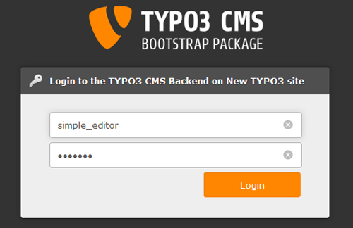

.. ==================================================
.. FOR YOUR INFORMATION
.. --------------------------------------------------
.. -*- coding: utf-8 -*- with BOM.

.. include:: ../Includes.txt

.. _backend:

Backend
=======

**backend hands-on ( reuse editor tutorial from typo3.org + getting started man)**

Backend users
-------------
The final step in our efforts to get this introduction website running is to look at distributed maintenance - a core requirement to a CMS. We already discussed the difference between frontend and backend users and how backend users were located in the root of the page tree:
[screenshot list BE User]
The introduction package is shipped with three users. Let's see what they can do. The best way to do this is to logout as admin and log in as one of these users, one at a time.

**Simple Editor**

When you log in as "simple_editor" you will see this when you activate the Page module and select the page "Examples" for editing:

Only the page "Content Examples" with its subpages the "simple_editor" is allowed to edit at that branch of the website. But it does not only reflect permission management - it also helps make the system more intuitive and user friendly. As you can see most of the backend modules are not shown to the simple_editor either. The menu to the left contains only the "Page" modules in addition to the "File" and "User settings" module.

.. figure:: ../Images/Backend/simple_Editor_BE1.png
    :width: 800px
	:alt: filelist as an simple editor

Images and Documents are managed in the "Filelist" module. The "simple_editor" sees all relevant folders like Images and Documents in the filelist.

**Advanced Editor**

**Administrator**

* BE presentation + 3 golden rules
* left menu presentation + topbar
* tree (content types + fe rendering + cache process + file management) --- to be taken from the getting started docu
* (put it where you want) : language management
* user settings
* shortcuts
* bonus : practical challenge - exercises
* backed hands-on for the advanced_editor
* difference in between S-Editor and A_editor tree + menus)
* page + list differences
* info
* functions
