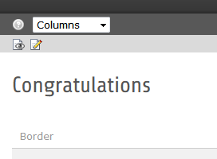

.. ==================================================
.. FOR YOUR INFORMATION
.. --------------------------------------------------
.. -*- coding: utf-8 -*- with BOM.

.. include:: ../Includes.txt

.. _faq:

FAQ
==========
**Which version of TYPO3 CMS are covered by this documentation?**
This documentation will cover versions of TYPO3 CMS 6.2.x

**Why do I not see any Backed Layout?**
To see the Backend Layout you must choose in the module menu page, the page and the column view in the content area.

**The links below the 3 TEXT & ICONS elements are only standard links instead of the orange colored buttons?**
Due to unsolved technical reasons there is an error in the html.
Solution: Open in the RTE the source code and change this `<a href="http://intro.typo3-themes.org/?id=35" class="btn" title="btn-primary">Features</a>` to `<a href="http://intro.typo3-themes.org/?id=35" class="btn btn-primary">Features</a>`
